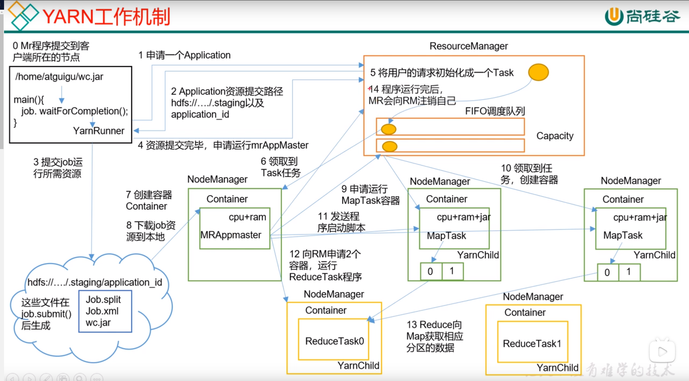

# 参考资料
- 尚硅谷大数据
- [小王是个弟弟](https://blog.csdn.net/qq_41858402)
# 1. Hadoop
## 1. hadoop常用端口号？
hadoop3.x 
- NameNode 对用户的查询端口：9870
- ResourceManagerYarn 查看任务运行情况的：8088
- MapReduce JobHistory Server：19888

## 2. HDFS文件块大小？
128M
## 3. HDFS的读写流程（面试重点）？
## 写流程
1) Client向NameNode发送写数据请求(包含待上传文件名和将要上传的路径)
2) NameNode检查路径是否存在，文件是否已存在、是否有写权限等。如果可以，namenode将该目录添加到目录树。
3) NameNode向客户端响应数据，可以上传文件。
5) 客户端根据文件大小进行切分一个个block块，并向NamaNode发送提交即将上传block1的请求
6) NameNode查询DataNode信息，规划block1的存储位置
7) NameNode向客户端返回block1可以存储的数据节点ip列表
8) 客户端直接请求数据节点1建立传输通道，上传block1，数据节点1存储block1完毕并根据ip列表将block1发送给数据节点2，数据节点2存储完毕block1并根据ip列表将block1发送给数据节点3，数据节点3存储完成响应数据给数据节点2，数据节点2将响应数据给数据节点1，数据节点1将存储结果返回给NameNode和客户端。传输的基本单位是Packet(64k)
9) 重复第四步上传下一个block

## 读流程
1) 客户端向NameNode请求下载文件(创建Distributed FileSystem来与DataNode通信)
2) NameNode返回目标文件的元数据
3) 客户端根据元数据向DataNode请求读取数据block(创建FSDataInputStream来读)，从离客户端最近的节点读，如果该节点负载大，则从其他节点读(考虑两点：最近节点和负载均衡)
4) DataNode向客户端传输数据
5) 重复第三步，直到所有的块传输完成
6) 客户端根据元数据组装block块完成读取数据#
## 4. MapReduce的工作流程

## 5. [Yarn的工作机制](https://mp.weixin.qq.com/s/xbvPSrp3C_kjoTUzF4LWng)（面试题）
### Yarn的基础架构
- ResourceManager
    - 处理客户端请求
    - 监控NodeManager
    - 启动或监控Applicationmaster
    - 资源的分配与调度
- NodeManager
    - 管理单个节点上的资源
    - 处理来自ResourceManager的命令
    - 处理来自ApplicationMaster的命令
- ApplicationMaster
    - 为应用程序申请资源并分配给内部的任务
    - 任务的监控与容错

### Yarn的工作机制

## 6. HDFS安全模式
安全模式是hadoop的一种保护机制，用于保证集群中的数据块的安全性。当集群启动的时候，会首先进入安全模式。当系统处于安全模式时会检查数据块的完整性。检查副本率小于设置的则会复制block到其他datanode中。
## 7. 什么是命名空间 namespace
hdfs文件系统里的文件夹、文件、文件结构(文件系统树)一起构成了namespace，metadata指的是这些文件夹或文件的属性。

## NameNode
首先，为了提高HDFS的读写速率，必定将NameNode的元数据存储在内存中，但是内存一旦断电元数据将丢失，因此必须将内存中的元数据存储在磁盘中用于备份。

当集群启动时，会将fsimage和edits内容加载到内存中。集群关闭时，会将fsimage与edits的内容进行合并。

fslmage存储的是数据，edits文件存储的是操作。

### Fsimage
Fsimage为内存元数据的备份。若内存的元数据发生改变，如果同时更新Fsimage会降低效率，如果不更新会发生数据不一致问题
### edits
针对上述问题，最终逻辑是不更新Fsimage文件，为解决数据不一致问题，引入edits文件，该文件只记录操作并且采用追加写 的形式，即每当内存的元数据发生改变的同时记录本次操作记录追加到磁盘中的edits，这样内存元数据等于磁盘的Fsimage + edits
### NameNode的工作机制
当NameNode启动时先滚动edits并生成一个空的edits.inprogress会将Fsimage和edits文件加载到内存中进行合并，之后的操作（增删）将追加到edits.inprogress中
## SecondaryNamdeNode工作机制？

作用：定期帮助namenode合并fsimage与edits的内容。促发条件: 1) 时间到了 2) edits里的数据满了

根据NameNode的工作机制，当edits的操作记录记录过多时不仅会降低追加效率，同时断电恢复时会花费大量时间，因此2NN将针对此问题进行解决，将触发检查条件时，2NN首先通知NameNode滚动edits生成新的eidts.inprogress（之后的最新操作记录将写在此文件）并通过http get的形式将磁盘的Fsimage和旧的edits复制过来并加载到内存中进行合并，生成Fsimage.chkpoint文件，并通过http post形式拷贝给NameNode重命名为Fsimage后替换原来的Fsimage。
# 2. Kafka
## 1. Partition 和 Replica
Producer产生的消息发布到topic里，Event会按照相同的**event key**追加到这个Topic的其中同一个Partition上。每一个Partition都会有若个Replica，这些Replica分布在不同的broker上，且每个broker至多只能有一个同一个Partition对应的Replica。所以一个topic的replica的数量不会多于broker的数量。

一个Partition的所有的Replica中，有一个是leader，其他都是follower。读写消息的过程只通过leader完成。

客户端可以控制向哪个partiton发送消息。默认的是随机发送，这样可以负载平衡。用户也可以自定义分区函数，例如使相同的user id的消息hash到同一个partition.
## 2. Pull or Push
Producer *Push* 到broker，然后由consumer 从broker里 *pull* 消息 
### Push方式
优点：Consumer可以以最大速率消费数据。  
缺点：broker不知道下游的消费者是否能够立即消费，它要决定是立即发送消息还是积累数据等待一段时间再发送。
### Pull方式
优点：consumer可以自定义消费速率; 能更好地以批方式拉取数据而不会导致延迟  
缺点：当broker没有消息时，consumer会等待。解决办法：设置等待的时间

## 3. kafka如何保证一致性语义？
### 3.1 消息传送保证
- At most once：最多发送一次，丢失不重发，会丢失数据。
- At least once：只发送一次，丢失会重发，所以永远不会丢失数据。
- Exactly once：每个数据只会且会被发送一次。
> 对于kafka包括*发布消息时地一致性保证*和*消费消息时的一致性保证*
## 3.2 发布消息时地一致性保证
当发布消息时，有一个“Committed”到日志里的概念。当消息是Committed时，只要它所在的broker存活就不会丢失。

在0.11.0.0版本之前，producer发布消息网络发生故障时，如果producer没有收到消息被committed的回复，那么它就会重发。这样可能会导致数据重复写入。

从0.11.0.0版本开始，kafka提供了**幂等( idempotent)发送**操作，可以保证重发的消息不会被重复写入。为了实现这一点，broker为每个生产者分配一个ID，并使用生产者连同每个消息一起发送的序列号对消息进行重复数据删除。

并且从0.11.0.0版本开始，生产者支持使用类似事务的语义将消息发送到多个主题分区的能力，即要么所有消息都被成功写入，要么没有消息被成功写入。

并不是所有的情况都需要这样强有力的保证。对于延迟敏感的场景，Producer可指定它想要的持久性级别。如果生产者指定它希望等待提交的消息，例如可指定10毫秒。然而，生产者也可以指定它希望完全异步地执行发送，或者它希望只等待leader(但不一定是follower)有确认消息。
## 3.3 消费消息时的一致性
所有replica都具有具有相同偏移量的完全相同的日志。如果消费者从未崩溃，它可以将这个offset存储在内存中，但如果消费者崩溃，topic分区被另一个进程接管，新进程将需要选择一个合适的offset开始消费。它有几个处理消息和更新其offset的选择。

当写入到外部系统时，需要协调consumer的位置和输出。经典的做法是**两段提交**，然而并不是所有的外部系统都支持两端提交。另一种简单的做法是让consumer把它的offset存储在与输出地方的相同位置。例如将数据和读取到的offset一起导入到HDFS中，这样就可以保证数据和偏移量都被更新或者都不更新。

## 3.4 副本 
 leader维护着"in sync"列表，当有follower崩了或者消息落后leader很多时，leader就会将这个follower从ISA中移除。现在可以更精确地定义，当该分区的所有同步副本都将消息写到到日志中时，该消息被认为已提交。只有已提交的消息才会分发给consumer。另一方面，生产者可以选择等待消息提交或不提交，这取决于他们在延迟和持久性之间的权衡。该选择由producer使用的acks设置控制。注意，topic有一个`minmum number` 的同步副本设置，当producer请求确认: 消息已经被写入ISA中所有的同步副本时，会检查该设置。如果生产者请求的是一个不那么严格的确认，即使同步中的副本数量低于最小值(例如，它可以低到只有leader)，那么消息可以被提交和消费，
## 3.5 Replicated Log
日志复制算法必须提供的基本保证是，如果告诉客户端一条消息已经提交，但同时leader不可用了，我们选举的新leader必须也有这个消息。当有多个follower时，就要权衡选举哪个follower作为leader。对于这个权衡，一个常用的方法是对**提交决定**和**leader选举**都采用**多票法**。这个方法族包括很多算法，如ZooKeeper的**Zab**, **Raft**和 **Viewstamped Replication**. 我们所知道的与Kafka的实际实现最相似的是微软的**PacificA**.

多数投票的缺点是，不需要太多的失败就会让你失去可选举的领导人。容忍一次故障需要数据的三份副本，容忍两次故障需要数据的五份副本。根据我们的经验，只有足够的冗余来容忍一次故障对于实际系统来说是不够的，但是使用5倍的磁盘空间需求和1/5的吞吐量，每写5次，对于大容量数据问题来说是不太实际的。这可能就是为什么仲裁算法(Quorum)在共享集群配置(如ZooKeeper)中更常见，但在主数据存储中不太常见的原因。例如，在HDFS中，namenode的高可用性特性是建立在基于多数投票的日志上的，但是这种更昂贵的方法并不用于数据本身。

Kafka在选择仲裁集时采取了一种稍微不同的方法。Kafka不是采用多数投票的方式，而是动态地维护一组与leader同步的副本(ISR)。只有这一组成员才有资格当选为领导人。对Kafka分区的写操作只有在所有同步副本都收到写操作后才被认为已提交。当ISR集发生变化时，它就会被保存到ZooKeeper中。正因为如此，ISR中的任何副本都有资格当选领导人。有了这个ISR模型和f+1副本，Kafka主题可以容忍f失败而不会丢失提交的消息。
## 如果都失败了怎么办？
有两种选择：
- 等待ISA中的一个副本复活，选择这个副本作为leader
- 选择最先复活的副本 (不需要在ISA中)作为leader.

两个选择各有优缺点：
- 选择1的话，如果ISA中的副本如果一致不复活，就要一直等下去。如果这些副本被破坏或数据丢失，那么将永久停机。
- 选择2的话，意味着要选择该副本里的数据作为参照标准，但是这个副本的数据完整性不能保证。

## ACK
Producer可以通过设置`acks = 0,1, -1(all)`, 选择是否等待, 消息被replicas确认。
- `acks = -1(all)`:当前ISA中的所有副本接收到消息时立即确认。
- `acks = 1`:
- `acks = 0`:

kafka提供了两种topic-level配置，可用于偏好消息持久性而非可用性:
- 禁用不干净的leader选举-如果所有副本都不可用，那么这个分区将一直不可用，直到最近的leader重新可用。
- 指定一个最小的ISR大小——只有当ISR的大小超过某个最小值时，该分区才会接受写操作，以防止仅写入单个副本的消息丢失，而该副本随后将不可用。只有当生产者使用acks=all并保证消息至少被这么多同步副本确认时，该设置才会生效。这种设置提供了一致性和可用性之间的权衡。设置较高的最小ISR大小可以保证更好的一致性，因为可以保证消息被写入更多的副本，从而减少消息丢失的概率。但是，它会降低可用性，因为如果同步副本的数量低于最小阈值，该分区将无法进行写操作。
## 副本管理
上面关于复制日志的讨论实际上只涵盖了单个日志，即一个主题分区。然而，Kafka集群将管理成百上千个这样的分区。我们试图以循环方式平衡集群中的分区，以避免将大容量主题的所有分区群集在少量节点上。同样地，我们试图平衡领导位置，以便每个节点都是其分区的比例份额的成为领导

优化领导选举过程也很重要。一个简单的leader选举实现是在节点失败时为每个分区执行一个leader选举。

不同的是kafka选择其中一个broker作为“Contoller”。该controller在broker-level检测故障，并负责更改故障broker中所有受影响分区的leader。结果是能够批量处理许多需要的leader变更通知，这使得选举过程对大量的分区来说更加方便和快速。

如果controller发生故障，则一个幸存的broker将成为新的controller。

# Spark
1) 什么是task, job, stage？
job就是taskset，遇到一个action算子就会产生一个job。
3) RDD, DataFrame和Dataset的区别？  
在SparkSQL中Spark提供了两个新的抽象，分别是DataFrame和DataSet。RDD、DataFrame、DataSet 全都是 spark 的分布式数据集。DataFrame是一种以RDD为基础的分布式数据集DataFrame与RDD的主要区别在于，DataFrame带有schema信息，即数据集中列的名称和类型信息，类似于关系数据库中的二维表。Dataset是一种强类型的特定对象的集合，它不仅包含数据集的结构信息，还包含数据集本身的类型信息。
4. coalesce和repartition的区别？
5. sortBy和sortByKey的区别？
6. map和mapPartition的区别？
7. reduceByKey和groupByKey的区别？
8. Spark中的广播变量和
9. Stage怎么划分的？
10. Spark与MR的区别？
11. 宽依赖和窄依赖的区别？
12. 共享变量和累加器？
13. Spark调优？
14. Spark on Yarn作业执行流程？yarn-client和yarn-cluster的区别？
15. Spark为什么比MapReduce快  
mapreduce 每个job处理完成之后所产生的结果数据保存在磁盘，后续有其他的job需要依赖于前面job的输出结果，就需要从磁盘里读取数据，性能就比较低。

spark任务每一次处理的完成之后所产生的结果数据可以保存在内存中，后续有其他的job需要依赖于前面job的输出结果，这里就可以直接从内存中获取得到，大大减少磁盘io操作，性能非常高。

Spark 计算比 MapReduce 快的根本原因在于 DAG 计算模型。一般而言，DAG 相比MapReduce 在大多数情况下可以减少 shuffle 次数。Spark 的 DAGScheduler 相当于一个改进版的 MapReduce，如果计算不涉及与其他节点进行数据交换，Spark 可以在内存中一次性完成这些操作，也就是中间结果无须落盘，减少了磁盘 IO 的操作。但是，如果计算过程中涉及数据交换，Spark 也是会把 shuffle 的数据写磁盘的！有一个误区，Spark 是基于内存的计算，所以快，这不是主要原因，要对数据做计算，必然得加载到内存，Hadoop 也是如此，只不过 Spark 支持将需要反复用到的数据给 Cache 到内存中，减少数据加载耗时，所以 Spark 跑机器学习算法比较在行（需要对数据进行反复迭代。

# Flink
## 1. Flink与Spark的区别？
Flink 是标准的实时处理引擎，基于事件驱动。而Spark Streaming 是微批（Micro-Batch）的模型。

### 1. 架构模型  
Spark 在运行时的主要角色包括：Master、Worker、Driver、Executor，Flink 在运行时主要包含：Jobmanager、Taskmanager和Slot。
### 2. 任务调度  
Spark Streaming 连续不断的生成微小的数据批次，构建有向无环图DAG，Spark Streaming 会依次创建 DStreamGraph、JobGenerator、JobScheduler。  
Flink 根据用户提交的代码生成 StreamGraph，经过优化生成 JobGraph，然后提交给 JobManager进行处理，JobManager 会根据 JobGraph 生成 ExecutionGraph，ExecutionGraph 是 Flink 调度最核心的数据结构，JobManager 根据 ExecutionGraph 对 Job 进行调度。
### 3. 时间机制
 - Spark Streaming 只支持processing time
 - structured streaming 只支持event time
 - Flink同时支持processing time, event time, ingesting time

### 4. 容错机制？
端到端的一致性：
- 内部保证 —— 依赖 checkpoint
- source 端 —— 需要外部源可重设数据的读取位置
- sink 端 —— 需要保证从故障恢复时，数据不会重复写入外部系统 

而对于 sink 端，又有两种具体的实现方式：
- 幂等（Idempotent）  
所谓幂等操作，是说一个操作，可以重复执行很多次，但只导致一次结果更改， 也就是说，后面再重复执行就不起作用了。
- 事务写入  
需要构建事务来写入外部系统，构建的事务对应着 checkpoint，等到 checkpoint 真正完成的时候，才把所有对应的结果写入 sink 系统中。

对于事务性写入，具体又有两种实现方式：
- 预写日志（WAL)
- 两阶段提交（2PC）

DataStream API 提供了 GenericWriteAheadSink 模板类和 TwoPhaseCommitSinkFunction 接口，可以方便地实现这两种方式的事务性写入

Spark streaming, structured streaming, flink都支持checkpointing来进行容错。但是他们的实现有所差别，spark streaming的Checkpoint仅仅是针对driver的故障恢复做了数据和元数据的Checkpoint。而flink的checkpoint机制要复杂了很多，它采用的是轻量级的分布式快照，实现了每个操作符的快照，及循环流的在循环的数据的快照。

#### spark streaming
输入端，容错级别取决于Source的特性
- Files 像HDFS这样本身就有容错能力，就可以保证exactly once级别的容错。
- Receiver-based Source
    - Reliable Receiver：可保证at-least once容错
    - Unreliable Receiver：不支持容错

输出端： 默认at-least once级别，可以通过**Idempotent updates**和**Transactional updates**自己实现exactly-once语义。   
#### structured streaming
通过**checkpointing**和**Write-Ahead Logs**实现了端到端的exactly-once容错保证。如果sourc具有offset，引擎通过checkpointing和write-ahead logs记录已经处理数据的offset范围。sink端被设计为幂等来解决重复处理的问题。通过使用replayable source和幂等sinks,structured streaming实现了在任何失败下的端到端的exactly-once语义。

但是在exactly-once容错保证下，structured streaming能实现100ms的延迟。在Spark 2.3版本引入了**Continuous Processing**后, 在at-least-once保证下实现1ms的延迟  

对于 Spark Streaming 任务，我们可以设置 checkpoint，然后假如发生故障并重启，我们可以从上次 checkpoint 之处恢复，但是这个行为只能使得数据不丢失，可能会重复处理，不能做到恰好一次处理语义。
### Flink
有状态流应用的一致检查点是该应用的所有任务的状态在某个时间点的一份拷贝，在该时间所有任务都恰好处理完一个相同的输入数据的时候。
Flink 则使用两阶段提交协议来解决这个问题。

## Flink的故障重启策略？
1) Fixed Delay Restart 给定重启次数和重启间隔时间，超过重启次数，重启失败
2) Failure Rate Restart 超过设置的failure rate(一个时间间隔内失败的次数)，重启失败
3) No Restart 失败后不重启
4) Fallback Restart 使用集群定义的重启策略

## 2. Flink的角色？
### JobManager
- 协调flink应用的分布式执行
- 协调checkpoint
- 协调失败重启
### TaskMagager
负责执行任务
### task slot
每一个task slot代表着TaskManager的资源的固定大小的子集。一个job的不同子任务可以共享task slot

task slot的数量代表着TaskManager的并发执行能力，parallelism代表的TaskManager的实际并发执行能力。
## 3. flink streaming的union, coGroup, join, connect算子的区别？
## `Union`
sql语法中[`union`](https://www.runoob.com/sql/sql-union.html)用于合并两个或多个SELECT 语句的结果集, `NION`只会选取不同的值。请使用 UNION ALL 来选取重复的值！
4. Flink的容错是怎么做的？
定期checkpoint存储operator state及keystate到stateBackend
6. Flink如何保证Exactly_Once？
1) 开启checkpoint
2) source支持数据重发
3) sink支持事务，可以分两次提交

满足以上3点可以保证exactly_once

8. FLink有哪些时间窗口？各自的使用场景？
- Tumbling Window
- Sliding Window
- Sesion Window
10. Flink的背压？
11. waterMark机制？
12. Flink双流Join
13. Flink两端提交原理？
14. Flink的任务提交方式？

`./bin/flink run examples/streaming/WordCount.jar`
15. Flink自定义函数有哪些
- 实现算子接口
- 匿名类
- 继承richFunction
16. flink算子有哪些类型？
- 转换算子
- Window算子
- ProcessFunction
16. flink和Kafka怎么保证数据不丢失

开启checkpoint, Flink Kafka Consumer从kafka中读取数据，会定期对offset进行checkpoint。当job failure时，会从offset处开始重新读取

# Keylin
1. Kylin调优？
2. Kylin的cuboid, cube, segment的关系
3. kylin的原理？
4. Kylin的构建过程

# Mysql
 1. mysql中B树和B+树的原理和区别？
 2. mysql事务锁有几种，分别是？

# Flume
1. 什么是Flume？FLume的运行机制？
2. flume会不会丢失数据？
# Sqoop
1. sqoop的运行的底层原理
2. 通过sqoop把数据加载到mysql中如何设置主键？
# Redis
1. 缓存穿透、缓存雪崩、缓存击穿
- 缓存穿透: 指的是查询一个不存在的数据，由于缓存中查询不到，每次请求都要到数据库中去查询，造成缓存穿透。解决办法：布隆过滤器
- 缓存雪崩：如果缓存集中在一段时间内失效，发生大量缓存穿透，就会造成缓存雪崩 解决方案：尽量让失效的时间点不分布在同一个时间点
- 缓存击穿：值得是一个key非常热，当这个key失效的瞬间，就会穿破缓存。解决方法：设置key永不过期
3. Redis的数据类型
4. Redis的持久化？
- RDB持久化
- AOF持久化：以日志的形式记录每个更新操作
5. Redis为什么快？
6) 完全基于内存
7) 采用单线程
8) 使用多路I/O复用模型，非阻塞IO
# Kfaka
1. Kafka ISR和AR是什么？
2. HW和LEO是什么？
3. Pull方式还是Push方式？
4. Kafka为什么快？怎么实现高吞吐率？
- 顺序读写
- 零拷贝
- 文件分段
- 批量发送
- 数据压缩
5. Kafka缺点？
- 因为批量发送，所以并非真的实时
- 仅支持分区内有序，无法 实现全局有序
- 依赖zookeeper
6. Kafka的读写流程
# Hbase
1. Hbase的读写流程？
2. Hmaster和Hregion server的职责？
3. Hbase-RowKey的设计
4. Hbase和Hive的区别和使用场景？
5. 
# 数仓
1. 数仓的分层及每层的作用？  
ODS(operation)，DWD(datail)，DWS(service)，DWT(topic)，ADS(application)
3. 事实表和维度表是什么？
4. 全量表、增量表、拉链表的区别？  
在更新表的数据时：
- 全量表会更新表的所有数据。适用于数据量不是很大，后续增长慢
- 增量表只会更新该表的数据和添加新增的数据。适用于数据量很大或数据量不大但是增长快的场景。制作方式：A表存在B表不存在 union B
- 拉链表会记录每条数据的生命周期。适用于历史状态需要保存的的场景。拉链表的制作过程？

5. 数仓模型有哪些？
- 星型模型：星形模型中有一张事实表，以及零个或多个维度表，事实表与维度表通过主键外键相关联，维度表之间没有关联
- 雪花模型：当有一个或多个维表没有直接连接到事实表上，而是通过其他维表连接到事实表上时
- 星座模型：星座模型是由星型模型延伸而来，星型模型是基于一张事实表而星座模式是基于多张事实表，并且共享维度表信息

6. 数据库三范式
- 第一范式：表中的每一列都是不可拆分的原子项
- 第二范式：满足第一范式；没有部分函数依赖。
- 第三范式：满足第二范式；没有传递函数依赖。

> 举个例子：通过AB能得出C，通过A也能得出C，通过B也能得出C，那么说C部分依赖于AB。部分函数依赖在组合属性下才有意义。通过A得到B，通过B得到C，但是C得不到B，B得不到A，那么成C传递依赖于A

7. UDF, UDAF, UDTF
- UDF:返回对应值，一对一
- UDAF：返回聚类值，多对一
- UDTF：返回拆分值，一对多

8. order by,sort by,distribute by,cluster by的区别？
9. 分桶表和分区表的区别？
10. 数据倾斜怎么办？
11. row_number, rank, dense_rank区别

